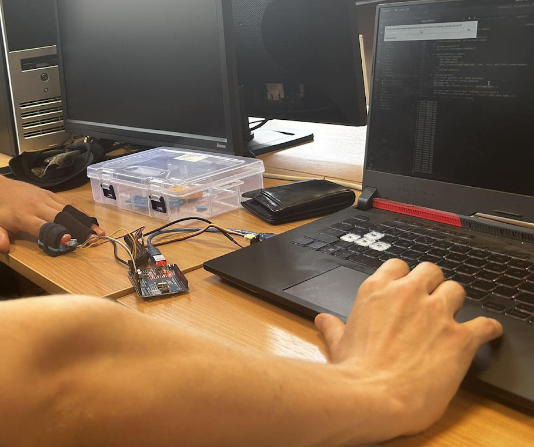
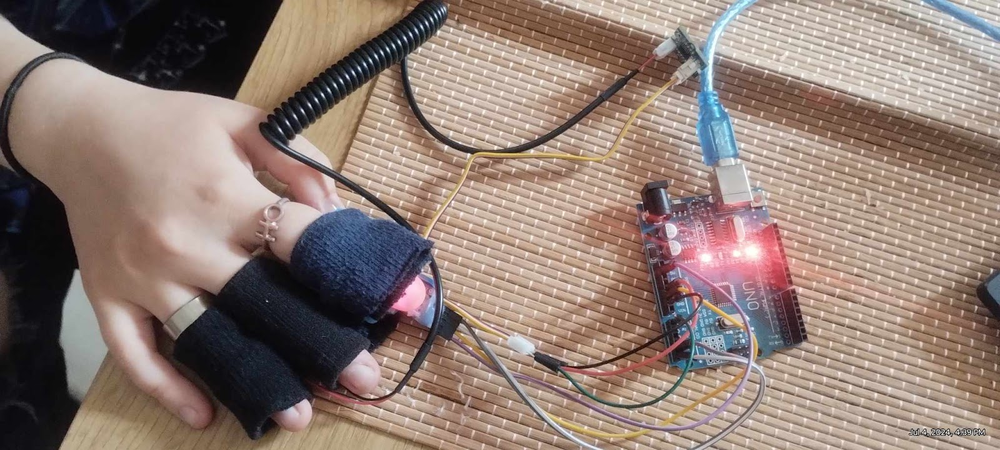
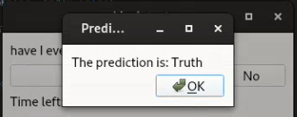
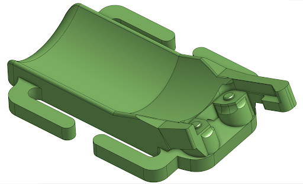

# Lie Detection System

<div style="text-align: center;">
  
  <p><strong>Usage</strong></p>
</div>

Me and 2 of my uni colleagues made this project for AI in medicine subject. 

This project combines hardware and software to create a system that can detect lies by analyzing physiological signals. Here's a quick overview of what this project entails and how everything fits together.

## Overview

This project develops a lie-detection system using a combination of hardware and software. The system is integrated with an app that displays questions and records the answers.

## Components

### Hardware

- **Arduino UNO**
- **Pulse oximeter sensor (Infrared + Red LEDs)**
- **Galvanic skin resistance sensor**

### Software

- **Desktop Application**: 
  - Collects training data by asking questions and prompting the person whether they have lied.

## Hardware Setup

The sensors are connected to an Arduino UNO, which sends data via a serial connection. The app serves as the project interface, prompting users with questions at 10-second intervals, recording serial data for analysis, and saving answers in separate CSV files.

### Pulse Oximeter

A specially designed and 3D-printed piece holds a finger using an elastic sleeve, providing a dark backdrop for the LED lights to measure resistance accurately. This setup ensures reliable sensor readings.

## Data Analysis

### Collection

- Data collection is done through Arduino via a serial connection using PySide6 for handling data collection.

### Processing

- **Low Pass Filtering**: Removes high-frequency noise.
- **Baseline Correction**: Mitigates the passive sweating effect over time.
- **Notch Filter**: Removes specified frequency ranges.
- **Clipping**: Limits peaks in the raw data to eliminate hardware artifacts.
- **Normalization**: Normalizes values to intervals, with each parameter having an interval of 1/10 of a second per reading.
- The processed data is composed into a 3x100 matrix and sent to a neural network model for prediction.

### Analysis

- Used Python3 with libraries like SciPy, Matplotlib, Pandas, NumPy, and PyKalman for scientific computing.
- Processed the raw GSR and PPG signals to obtain 9-second signals from each question interval, resulting in 90 samples per recording for training.

## Example Data

The CSV data obtained after processing looks like this:

```
Timestamps,GSR_Data,Red_PPG_Data,IR_PPG_Data,Processed_PPG_Data,SpO2,BPM
2.0,0.916,249217,195520,-81.629503,103.36753940548783,78.94736
2.075,0.937,249303,195525,-117.22019,101.36651055170812,78.94736
```

## Training and Dataset

### Dataset

- Consists of around 300 questions from 4 difficulty categories.

### Training

- Initial training with 91 recordings showed an accuracy of about 73.68%.

## Issues and Improvements

- The model's accuracy could be improved by collecting more data and refining the training dataset.
- Occasionally, the pulse oximeter sensor stops working due to cable issues, requiring a reconnection of the Arduino.

## More images

<div style="text-align: center;">
  <div style="display: flex; flex-wrap: wrap; justify-content: center;">
    <div style="margin: 10px;">
      
      <p><strong>Hardware</strong></p>
    </div>
    <div style="margin: 10px;">
      
      <p><strong>Software</strong></p>
    </div>
    <div style="margin: 10px;">
      
      <p><strong>3D model used for printing the oxidation sensor case</strong></p>
    </div>
</div>
